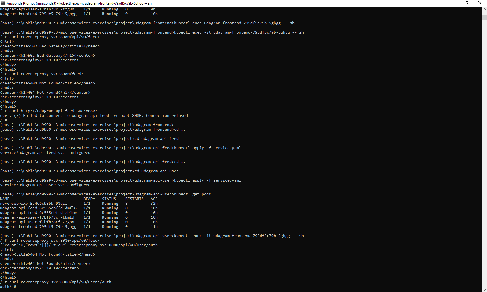
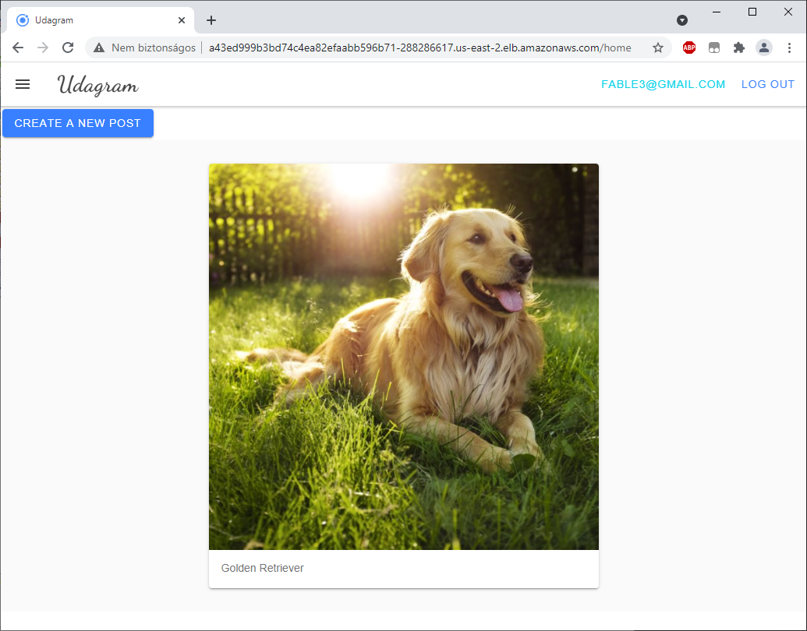

# Udagram Image Filtering Application

Udagram is a simple cloud application developed alongside the Udacity Cloud Engineering Nanodegree. It allows users to register and log into a web client, post photos to the feed, and process photos using an image filtering microservice.

The project is split into two parts:
1. Frontend - Angular web application built with Ionic Framework
2. Backend RESTful API - Node-Express application

## Getting Started
> _tip_: it's recommended that you start with getting the backend API running since the frontend web application depends on the API.

### Prerequisite
1. The depends on the Node Package Manager (NPM). You will need to download and install Node from [https://nodejs.com/en/download](https://nodejs.org/en/download/). This will allow you to be able to run `npm` commands.
2. Environment variables will need to be set. These environment variables include database connection details that should not be hard-coded into the application code.
#### Environment Script
A file named `set_env.sh` has been prepared as an optional tool to help you configure these variables on your local development environment.

We do _not_ want your credentials to be stored in git. After pulling this `starter` project, run the following command to tell git to stop tracking the script in git but keep it stored locally. This way, you can use the script for your convenience and reduce risk of exposing your credentials.
`git rm --cached set_env.sh`

Afterwards, we can prevent the file from being included in your solution by adding the file to our `.gitignore` file.

### Database
Create a PostgreSQL database either locally or on AWS RDS. Set the config values for environment variables prefixed with `POSTGRES_` in `set_env.sh`.

### S3
Create an AWS S3 bucket. Set the config values for environment variables prefixed with `AWS_` in `set_env.sh`.

### Backend API
* To download all the package dependencies, run the command from the directory `udagram-api/`:
    ```bash
    npm install .
    ```
* To run the application locally, run:
    ```bash
    npm run dev
    ```
* You can visit `http://localhost:8080/api/v0/feed` in your web browser to verify that the application is running. You should see a JSON payload. Feel free to play around with Postman to test the API's.

### Frontend App
* To download all the package dependencies, run the command from the directory `udagram-frontend/`:
    ```bash
    npm install .
    ```
* Install Ionic Framework's Command Line tools for us to build and run the application:
    ```bash
    npm install -g ionic
    ```
* Prepare your application by compiling them into static files.
    ```bash
    ionic build
    ```
* Run the application locally using files created from the `ionic build` command.
    ```bash
    ionic serve
    ```
* You can visit `http://localhost:8100` in your web browser to verify that the application is running. You should see a web interface.

## Tips
1. Take a look at `udagram-api` -- does it look like we can divide it into two modules to be deployed as separate microservices?

2. The `.dockerignore` file is included for your convenience to not copy `node_modules`. Copying this over into a Docker container might cause issues if your local environment is a different operating system than the Docker image (ex. Windows or MacOS vs. Linux).

3. It's useful to "lint" your code so that changes in the codebase adhere to a coding standard. This helps alleviate issues when developers use different styles of coding. `eslint` has been set up for TypeScript in the codebase for you. To lint your code, run the following:
    ```bash
    npx eslint --ext .js,.ts src/
    ```
    To have your code fixed automatically, run
    ```bash
    npx eslint --ext .js,.ts src/ --fix
    ```
    
4. Over time, our code will become outdated and inevitably run into security vulnerabilities. To address them, you can run:
    ```bash
    npm audit fix
    ```
    
5. In `set_env.sh`, environment variables are set with `export $VAR=value`. Setting it this way is not permanent; every time you open a new terminal, you will have to run `set_env.sh` to reconfigure your environment variables. To verify if your environment variable is set, you can check the variable with a command like `echo $POSTGRES_USERNAME`.


# Development

After S3 bucket setup and setting policy, the suggested template had the following error:

`Missing required field Principal`

I've added the "principal": `Action does not apply to any resource(s) in statement`

After investigation, I've split up the actions and added "/*" where needed, the resulting policy looks like this:

```json
{
    "Version": "2012-10-17",
    "Id": "Policy1620422653395",
    "Statement": [
        {
            "Sid": "Stmt1620422120278",
            "Effect": "Allow",
            "Principal": {
                "AWS": "arn:aws:iam::447830847150:root"
            },
            "Action": [
                "s3:DeleteObject",
                "s3:GetObject",
                "s3:PutObject"
            ],
            "Resource": "arn:aws:s3:::udagram-447830847150-dev/*"
        },
        {
            "Sid": "Stmt1620422650340",
            "Effect": "Allow",
            "Principal": {
                "AWS": "arn:aws:iam::447830847150:root"
            },
            "Action": "s3:ListBucket",
            "Resource": "arn:aws:s3:::udagram-447830847150-dev"
        }
    ]
}
```

I also added CORS policy to be able modify the S3 bucket from anywhere during development. The CORS configuration must be in JSON, so I rewrote the XML into JSON:

```json
[
    {
        "AllowedHeaders": [
            "*"
        ],
        "AllowedMethods": [
            "PUT",
            "POST",
            "DELETE"
        ],
        "AllowedOrigins": [
            "*"
        ],
        "ExposeHeaders": []
    }
]
```

#### Local environment

The starter code didn't run.  I've tested the connection with the following command in Windows to make sure the environment variables are set up correctly: `"c:\Program Files\PostgreSQL\13\bin\psql.exe" -h %POSTGRES_HOST% -U %POSTGRES_USERNAME% %POSTGRES_DB%`

After investigation, it turned out that Postgres module had to be updated to a newer version.

The API is split up to 2 projects: udagram-api-feed and udagram-api-user

I've kept the original structure, just removed the extra code and added "feed" and "users" to the path to test without reverse proxy. I've used browser to test the "feed" endpoint and Postman to test the "users".

#### Docker Image

The Dockerfile is configured based on `node:13`. To create the javascript files from typescript, I used `npm run build` command, but modified the `packages.json` file and removed the `Archive.zip` creation, which is not needed here.

I started with building the udagram-api-user and tested it locally:

`docker build -t udagram-api-user . `

`docker run -e POSTGRES_USERNAME=udagramfabledev -e POSTGRES_PASSWORD=... -e POSTGRES_HOST=udagramfabledev.cj4gcaehy9yy.us-east-2.rds.amazonaws.com -e POSTGRES_DB=udagramfabledev -e AWS_BUCKET=udagram-447830847150-dev -e AWS_REGION=us-east-2 -e AWS_PROFILE=default -e JWT_SECRET=... -e URL=http://localhost:8100 -p 8080:8080 udagram-api-user`

Once the test was successful, in the `server.ts` I changed the path to remove the `/api/v0/users` part, since I plan to create a reverse proxy to handle this part of the path. The docker image was then tagged and pushed to the hub:

`docker tag udagram-api-user fable3/udagram-api-user`

`docker login --username=fable3 `

`docker push`


#### Travis CI

I've created a `.travis.yml` file in the project root, and added all docker build and push commands. It'd be probably better to split the project into several Git repositories, so that the docker image builds would trigger independently.

I've also entered my DockerHub username and password as environment variables, so that it's not visible in the repository or the log files.

#### Kubernetes

I've setup the Amazon EKS, created a cluster named `Udagram`, and node group. For the cluster, an EKS role was created with `AmazonEKSClusterPolicy`

For the node group, I created a role for the EC2 service with the following policies: AmazonEKSWorkerNodePolicy, AmazonEC2ContainerRegistryReadOnly, AmazonEKS_CNI_Policy.

To solve the `You must be logged in to the server (Unauthorized)`error, I've created a new Access Key in My Security Credentials, and used it in `aws configure`. 

For every microservice, a separate deployment.yaml and service.yaml file was applied. In addition, I created a config file for the environment variables, and used it in the deployment.yaml file:

```yaml
apiVersion: apps/v1
kind: Deployment
metadata:
  name: udagram-api-user
  labels:
    app: udagram-api-user
spec:
  replicas: 2
  selector:
    matchLabels:
      app: udagram-api-user
  template:
    metadata:
      labels:
        app: udagram-api-user
    spec:
      containers:
      - name: udagram-api-user
        image: fable3/udagram-api-user
        ports:
        - containerPort: 8080
        env:
        - name: URL
          valueFrom:
            configMapKeyRef:
              name: env-config
              key: URL
        - name: AWS_BUCKET
          valueFrom:
            configMapKeyRef:
              name: env-config
              key: AWS_BUCKET
        - name: POSTGRES_USERNAME
          valueFrom:
            configMapKeyRef:
              name: env-config
              key: POSTGRES_USERNAME
        - name: POSTGRES_PASSWORD
          valueFrom:
            configMapKeyRef:
              name: env-config
              key: POSTGRES_PASSWORD
        - name: POSTGRES_DB
          valueFrom:
            configMapKeyRef:
              name: env-config
              key: POSTGRES_DB
        - name: POSTGRES_HOST
          valueFrom:
            configMapKeyRef:
              name: env-config
              key: POSTGRES_HOST
        - name: AWS_REGION
          valueFrom:
            configMapKeyRef:
              name: env-config
              key: AWS_REGION
        - name: AWS_PROFILE
          valueFrom:
            configMapKeyRef:
              name: env-config
              key: AWS_PROFILE
        - name: JWT_SECRET
          valueFrom:
            configMapKeyRef:
              name: env-config
              key: JWT_SECRET
```

For HPA to work, I followed this guide: https://aws.amazon.com/premiumsupport/knowledge-center/eks-metrics-server-pod-autoscaler/?nc1=h_ls

`kubectl apply -f https://github.com/kubernetes-sigs/metrics-server/releases/download/v0.3.6/components.yaml`

Added resource requirements to deployment.yaml file:

```yaml
        resources:
          requests:
            memory: "64Mi"
            cpu: "250m"
          limits:
            memory: "1024Mi"
            cpu: "500m"

```

#### Debugging

The frontend was unable to connect to the backend, and the error message showed that it was trying to connect to localhost:8080. I also had to change reverseproxy service to LoadBalancer to have an external IP. The `src/environments` had 2 separate files for hard-coded `apiHost` values, but since I didn't include the `--prod ` flag in my Dockerfile, I changed both to `http://ab20b883ead7b4db3970062cfe90b252-1637117120.us-east-2.elb.amazonaws.com:8080/api/v0`

I checked that I can access the API from the fronted pod, but I couldn't, so I fixed the service.yaml file where I had mismatched labels, and after that it worked:



Restarted frontend: `kubectl rollout restart deployment udagram-frontend`

This also pulls the latest image, because in the deployment I refer to the latest docker image, which automatically changes the image pull policy from "if not exists" to "always".

`image: fable3/udagram-frontend:latest`

The browser still tried to connect to the old backend, so I logged in to check if it's the new image:

```
kubectl exec -it udagram-frontend-7b949b9574-xhr6z -- sh
cd /usr/share/nginx/html/
cat main.js | grep apiHost
```

The problem was in the browser, I disabled cache, and it used the updated URL, but I got the following error:

`Access to XMLHttpRequest at 'http://ab20b883ead7b4db3970062cfe90b252-1637117120.us-east-2.elb.amazonaws.com:8080/api/v0/feed' from origin 'http://a43ed999b3bd74c4ea82efaabb596b71-288286617.us-east-2.elb.amazonaws.com' has been blocked by CORS policy: Response to preflight request doesn't pass access control check: Redirect is not allowed for a preflight request.`

The solution was in https://knowledge.udacity.com/questions/317030 to drop the trailing / from the reverseproxy config.

Next error: `Access to XMLHttpRequest at 'http://ab20b883ead7b4db3970062cfe90b252-1637117120.us-east-2.elb.amazonaws.com:8080/api/v0/feed' from origin 'http://a43ed999b3bd74c4ea82efaabb596b71-288286617.us-east-2.elb.amazonaws.com' has been blocked by CORS policy: Response to preflight request doesn't pass access control check: The 'Access-Control-Allow-Origin' header has a value 'http://a43ed999b3bd74c4ea82efaabb596b71-288286617.us-east-2.elb.amazonaws.com:80' that is not equal to the supplied origin.`

So removed the trailing :80 from the URL in my config, and restarted the feed service:

```
kubectl apply -f env-config.yaml
kubectl rollout restart deployment udagram-api-feed
```

Next: I get 404 for `http://ab20b883ead7b4db3970062cfe90b252-1637117120.us-east-2.elb.amazonaws.com:8080/api/v0/feed`

Inside the feed pod it's working:

```
kubectl exec -it udagram-api-feed-745448ffcf-npjk7 -- sh
# curl localhost:8080
{"count":0,"rows":[]}
```

Inside reverseproxy it's not working:

```
kubectl exec -it reverseproxy-6b75d5f9d7-zvhbs -- sh
/ # curl localhost:8080/api/v0/feed
<!DOCTYPE html>
<html lang="en">
<head>
<meta charset="utf-8">
<title>Error</title>
</head>
<body>
<pre>Cannot GET /api/v0/feed</pre>
</body>
</html>
```

I think the problem is that the proxy_pass URL ends with :8080, so I changed the backed api and the reverseproxy to route to /api/v0/feed inside the feed api:

```
        location /api/v0/feed {
            proxy_pass http://udagram-api-feed-svc:8080/api/v0/feed;
        }
```

Backend now works from browser:

`http://ab20b883ead7b4db3970062cfe90b252-1637117120.us-east-2.elb.amazonaws.com:8080/api/v0/feed/`

The frontend was also working up to a point where I tried to upload a picture. Following a knowledge post to https://docs.aws.amazon.com/sdk-for-javascript/v3/developer-guide/loading-node-credentials-environment.html I've set up my keys and modified the feed deployment to include these environment values. It still didn't work, as I expected, so I also removed the 2 lines of AWS credential override:

```typescript
//const credentials = new AWS.SharedIniFileCredentials({profile: 'default'});
//AWS.config.credentials = credentials;
```

After this, the image was uploaded successfully.

The frontend is accessible at http://a43ed999b3bd74c4ea82efaabb596b71-288286617.us-east-2.elb.amazonaws.com/

